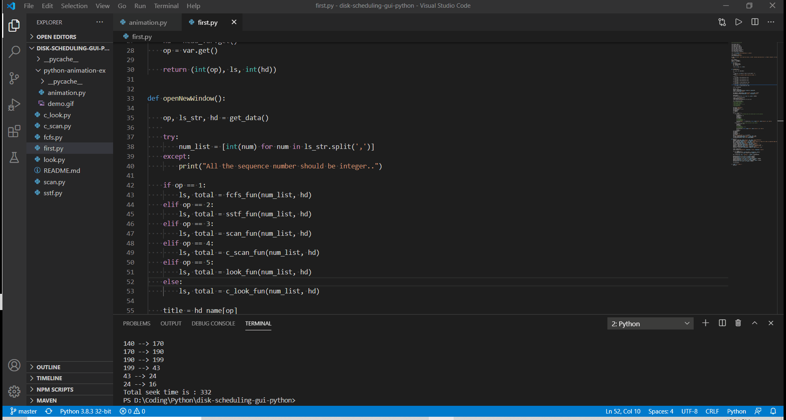

# Disk Scheduling GUI in Python

### Python modules used in this projects 
1. tkinter
2. turtle

### Implemented Algorithms
1. FCFS - First Come First Serve
2. SSTF - Shorest Seek Time First
3. SCAN - Elevator
4. C-SCAN - Circular Scan
5. LOOK
6. C-LOOK - Circular Look

### Here is the demo video

